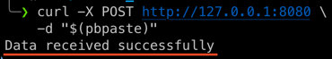

# webHooks

This simple GoLang application provides a local testing environment for services utilizing webhooks. It allows users to test webhook functionality without the need for external public services. Particularly useful when working with sensitive data, this server ensures that testing is secure and private.

## Features:

- **Local Testing Environment**: Run the server locally to simulate webhook events within a controlled environment.
- **Secure Testing with Sensitive Data**: Keep your sensitive data secure by avoiding the use of external public services for webhook testing.

## Getting Started:

### Prerequisites:

- [GoLang](https://golang.org/) installed on your machine.

### Installation:

1. Clone the repository:

   ```bash
   git clone https://github.com/rkiwi/webHooks.git
   cd webHooks
   ```
2. Build the executable:

   ```bash
   go build webHooks.go
   ```
3. Run the server:
   ```bash
   ./webHooks
   ```

### Usage:

The server provides several options that can be configured through command-line flags:

```text
-answer (bool)
Enable/disable answer from service (Status: OK, Data received) (default true)

```
```text
-headers  (bool)
Enable/disable technical information of request (default true)
```

```text
-port int
Set listening port of webhook catcher (default 8080)
```

```text
-pretty  (bool)
Enable/disable pretty JSON formatting (default true)
```